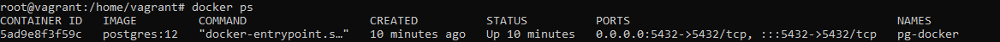
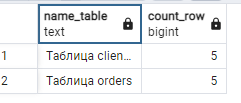
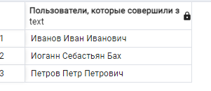
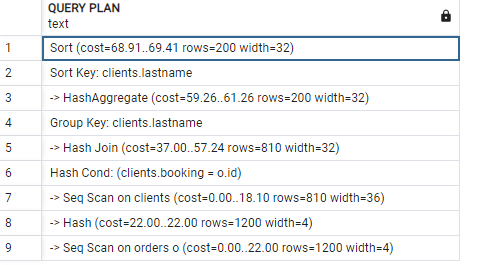

# Домашнее задание к занятию "6.2. SQL"

## Задача 1

Используя docker поднимите инстанс PostgreSQL (версию 12) c 2 volume, 
в который будут складываться данные БД и бэкапы.

Приведите получившуюся команду или docker-compose манифест.
```commandline
# docker pull postgres:12
root@vagrant:/home/vagrant# docker images
REPOSITORY   TAG       IMAGE ID       CREATED      SIZE
postgres     12        94046d1cabc3   4 days ago   373MB
root@vagrant:/home/vagrant# docker volume create vol2
vol2
root@vagrant:/home/vagrant# docker volume create vol1
vol1

root@vagrant:/home/vagrant# docker run --rm --name pg-docker -e POSTGRES_PASSWORD=postgres -ti -p 5432:5432 -v vol1:/var/lib/postgresql/data -v vol2:/var/lib/postgresql postgres:12
```


## Задача 2

В БД из задачи 1: 
- создайте пользователя test-admin-user и БД test_db
```commandline
root@vagrant:/home/vagrant# docker exec -it 5ad9e8f3f59c bash
root@5ad9e8f3f59c:/# psql -U postgres
psql (12.11 (Debian 12.11-1.pgdg110+1))
Type "help" for help.

postgres=# CREATE DATABASE test_db;
CREATE DATABASE
postgres=# \c test_db
psql (14.2, server 12.11 (Debian 12.11-1.pgdg110+1))
You are now connected to database "test_db" as user "postgres".
test_db=# CREATE ROLE "test-admin-user" SUPERUSER NOCREATEDB NOCREATEROLE NOINHERIT LOGIN;
CREATE ROLE
test_db=#
```
- в БД test_db создайте таблицу orders и clients (спeцификация таблиц ниже)
- предоставьте привилегии на все операции пользователю test-admin-user на таблицы БД test_db
- создайте пользователя test-simple-user  
- предоставьте пользователю test-simple-user права на SELECT/INSERT/UPDATE/DELETE данных таблиц БД test_db

Таблица orders:
- id (serial primary key)
- наименование (string)
- цена (integer)

Таблица clients:
- id (serial primary key)
- фамилия (string)
- страна проживания (string, index)
- заказ (foreign key orders)
```commandline
test_db=# CREATE TABLE orders
test_db-# (
test_db(# id integer,
test_db(# name text,
test_db(# price integer,
test_db(# PRIMARY KEY (id)
test_db(# );
CREATE TABLE
test_db=#
test_db=# CREATE TABLE clients
test_db-# (
test_db(#       id integer PRIMARY KEY,
test_db(#       lastname text,
test_db(#       country text,
test_db(#       booking integer,
test_db(#       FOREIGN KEY (booking) REFERENCES orders (Id)
test_db(# );
CREATE TABLE
test_db=#
test_db=# CREATE ROLE "test-simple-user" NOSUPERUSER NOCREATEDB NOCREATEROLE NOINHERIT LOGIN;
ERROR:  role "test-simple-user" already exists
test_db=# GRANT SELECT ON TABLE public.clients TO "test-simple-user";
GRANT
test_db=# GRANT INSERT ON TABLE public.clients TO "test-simple-user";
GRANT
test_db=# GRANT UPDATE ON TABLE public.clients TO "test-simple-user";
GRANT
test_db=# GRANT DELETE ON TABLE public.clients TO "test-simple-user";
GRANT
test_db=# GRANT SELECT ON TABLE public.orders TO "test-simple-user";
GRANT
test_db=# GRANT INSERT ON TABLE public.orders TO "test-simple-user";
GRANT
test_db=# GRANT UPDATE ON TABLE public.orders TO "test-simple-user";
GRANT
test_db=# GRANT DELETE ON TABLE public.orders TO "test-simple-user";
GRANT
test_db=# GRANT ALL ON TABLE orders, clients TO "test-admin-user";
GRANT
```


Приведите:
- итоговый список БД после выполнения пунктов выше,
- описание таблиц (describe)
```commandline
test_db=# \l
                                 List of databases
   Name    |  Owner   | Encoding |  Collate   |   Ctype    |   Access privileges
-----------+----------+----------+------------+------------+-----------------------
 postgres  | postgres | UTF8     | en_US.utf8 | en_US.utf8 |
 template0 | postgres | UTF8     | en_US.utf8 | en_US.utf8 | =c/postgres          +
           |          |          |            |            | postgres=CTc/postgres
 template1 | postgres | UTF8     | en_US.utf8 | en_US.utf8 | =c/postgres          +
           |          |          |            |            | postgres=CTc/postgres
 test_db   | postgres | UTF8     | en_US.utf8 | en_US.utf8 |
(4 rows)
```
- SQL-запрос для выдачи списка пользователей с правами над таблицами test_db
```
test_db=# SELECT
test_db-#     grantee, table_name, privilege_type
test_db-# FROM
test_db-#     information_schema.table_privileges
test_db-# WHERE
test_db-#     grantee in ('test-admin-user','test-simple-user')
test_db-#     and table_name in ('clients','orders')
test_db-# order by
test_db-#     1,2,3;
     grantee      | table_name | privilege_type
------------------+------------+----------------
 test-admin-user  | clients    | DELETE
 test-admin-user  | clients    | INSERT
 test-admin-user  | clients    | REFERENCES
 test-admin-user  | clients    | SELECT
 test-admin-user  | clients    | TRIGGER
 test-admin-user  | clients    | TRUNCATE
 test-admin-user  | clients    | UPDATE
 test-admin-user  | orders     | DELETE
 test-admin-user  | orders     | INSERT
 test-admin-user  | orders     | REFERENCES
 test-admin-user  | orders     | SELECT
 test-admin-user  | orders     | TRIGGER
 test-admin-user  | orders     | TRUNCATE
 test-admin-user  | orders     | UPDATE
 test-simple-user | clients    | DELETE
 test-simple-user | clients    | INSERT
 test-simple-user | clients    | SELECT
 test-simple-user | clients    | UPDATE
 test-simple-user | orders     | DELETE
 test-simple-user | orders     | INSERT
 test-simple-user | orders     | SELECT
 test-simple-user | orders     | UPDATE
(22 rows)
```
- список пользователей с правами над таблицами test_db
```test_db=# \du
                                       List of roles
    Role name     |                         Attributes                         | Member of
------------------+------------------------------------------------------------+-----------
 postgres         | Superuser, Create role, Create DB, Replication, Bypass RLS | {}
 test-admin-user  | Superuser, No inheritance                                  | {}
 test-simple-user | No inheritance                                             | {}


test_db=# \dt
          List of relations
 Schema |  Name   | Type  |  Owner
--------+---------+-------+----------
 public | clients | table | postgres
 public | orders  | table | postgres
(2 rows)

test_db=# \d+ clients
                                   Table "public.clients"
  Column  |  Type   | Collation | Nullable | Default | Storage  | Stats target | Description
----------+---------+-----------+----------+---------+----------+--------------+-------------
 id       | integer |           | not null |         | plain    |              |
 lastname | text    |           |          |         | extended |              |
 country  | text    |           |          |         | extended |              |
 booking  | integer |           |          |         | plain    |              |
Indexes:
    "clients_pkey" PRIMARY KEY, btree (id)
Foreign-key constraints:
    "clients_booking_fkey" FOREIGN KEY (booking) REFERENCES orders(id)
Access method: heap


test_db=# \d+ orders
                                   Table "public.orders"
 Column |  Type   | Collation | Nullable | Default | Storage  | Stats target | Description
--------+---------+-----------+----------+---------+----------+--------------+-------------
 id     | integer |           | not null |         | plain    |              |
 name   | text    |           |          |         | extended |              |
 price  | integer |           |          |         | plain    |              |
Indexes:
    "orders_pkey" PRIMARY KEY, btree (id)
Referenced by:
    TABLE "clients" CONSTRAINT "clients_booking_fkey" FOREIGN KEY (booking) REFERENCES orders(id)
Access method: heap
```
## Задача 3

Используя SQL синтаксис - наполните таблицы следующими тестовыми данными:

Таблица orders

|Наименование|цена|
|------------|----|
|Шоколад| 10 |
|Принтер| 3000 |
|Книга| 500 |
|Монитор| 7000|
|Гитара| 4000|

```commandline
INSERT INTO orders VALUES (1, 'Шоколад', 10), (2, 'Принтер', 3000), (3, 'Книга', 500), (4, 'Монитор', 7000), (5, 'Гитара', 4000);
```
Таблица clients

|ФИО|Страна проживания|
|------------|----|
|Иванов Иван Иванович| USA |
|Петров Петр Петрович| Canada |
|Иоганн Себастьян Бах| Japan |
|Ронни Джеймс Дио| Russia|
|Ritchie Blackmore| Russia|

```commandline
INSERT INTO clients VALUES (1, 'Иванов Иван Иванович', 'USA'), (2, 'Петров Петр Петрович', 'Canada'), (3, 'Иоганн Себастьян Бах', 'Japan'), (4, 'Ронни Джеймс Дио', 'Russia'), (5, 'Ritchie Blackmore', 'Russia');
```
Используя SQL синтаксис:
- вычислите количество записей для каждой таблицы 
```commandline
SELECT 'Таблица clients' as name_table,count(*) as count_row	FROM public.clients union all
SELECT 'Таблица orders',count(*) FROM public.orders;
```
- приведите в ответе:
    - запросы 
    - результаты их выполнения.  


## Задача 4

Часть пользователей из таблицы clients решили оформить заказы из таблицы orders.

Используя foreign keys свяжите записи из таблиц, согласно таблице:

|ФИО|Заказ|
|------------|----|
|Иванов Иван Иванович| Книга |
|Петров Петр Петрович| Монитор |
|Иоганн Себастьян Бах| Гитара |

Приведите SQL-запросы для выполнения данных операций.
```commandline
update  clients set booking = 3 where id = 1;
update  clients set booking = 4 where id = 2;
update  clients set booking = 5 where id = 3;
```

Приведите SQL-запрос для выдачи всех пользователей, которые совершили заказ, а также вывод данного запроса.

>select distinct lastname as "Пользователи, которые совершили заказ" from clients  join orders o  on booking = o.id order by  lastname;



Подсказк - используйте директиву `UPDATE`.

## Задача 5

Получите полную информацию по выполнению запроса выдачи всех пользователей из задачи 4 
(используя директиву EXPLAIN).

Приведите получившийся результат и объясните что значат полученные значения.
```commandline
EXPLAIN
select distinct lastname as "Пользователи, которые совершили заказ" from clients  join orders o  on booking = o.id order by  lastname;
```

```commandline
Выводит план запроса, операции время выполнения - какие использует алгоритмы.
Сортировка, группировка, выбор метода соединиения.  
```

## Задача 6

Создайте бэкап БД test_db и поместите его в volume, предназначенный для бэкапов (см. Задачу 1).

Остановите контейнер с PostgreSQL (но не удаляйте volumes).

Поднимите новый пустой контейнер с PostgreSQL.

Восстановите БД test_db в новом контейнере.

Приведите список операций, который вы применяли для бэкапа данных и восстановления. 

```commandline
root@ubuntu:/# docker exec -t pg-docker pg_dump -U postgres test_db -f /var/lib/postgresql/data/dump_test.sql


root@vagrant:/home/vagrant# docker exec -i pg-docker-2 psql -U postgres -d test_db -f /var/lib/postgresql/data/dump_test.sql
SET
SET
SET
SET
SET
 set_config
------------

(1 row)

SET
SET
SET
SET
SET
SET
CREATE TABLE
ALTER TABLE
CREATE TABLE
ALTER TABLE
COPY 5
COPY 5
ALTER TABLE
ALTER TABLE
ALTER TABLE
GRANT
GRANT
GRANT
GRANT
```
